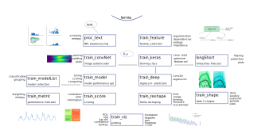

# lernia


Lernia is a machine learning library with focus on geo data and time series.


_lernia module_

## library description

Content:

* etl
* data cleaning 
* [feature selection](https://github.com/sabeiro/spiega/blob/master/markdown/lernia_feature.md)
* feature transformation
* training

## modules descriptions

[doc page](https://github.com/sabeiro/spiega/blob/master/markdown/lernia.md)

modules are divided into main blocks:

> learning

* `train_reshape.py`
	* utils to reshape data prior/post traning 
* `train_shape.py`
	* reduce curves shapes into useful metrics for training
* `train_feature.py`
	* utils for feature statistics, elimination, importance
* `train_interp.py`
	* iterpolation for smoothing data
* `train_score.py`
	* scoring utils for performances
* `train_metric.py`
	* important metrics for scoring and performance
* `train_viz.py`
	* visualization utils for performances and data statistics
* `train_modelList.py`
	* collection of sklearn models to compare performances
* `train_model.py`
	* iteration and tuning on sklearn models
* `train_keras.py`
	* parent class for training with keras
* `train_deep.py`
	* deep learning models for regression and predictions
* `train_longShort.py`
	* long short term memory models for predicting time sereies
* `train_convNet.py`
	* convolutional neural networs to predict small images
* `train_execute.py`
	* execution of learning libraries based on custom problems

## Data structure

Every single time series is represented as a 

## shapeLib

```python
redF = t_s.reduceFeature(X)
redF.interpMissing()
redF.fit(how="poly")
redF.smooth(width=3,steps=7)
dayN = redF.replaceOffChi(sact['id_clust'],threshold=0.03,dayL=sact['day'])
dayN[dayN['count']>30].to_csv(baseDir + "raw/tank/poi_anomaly_"+i+".csv",index=False)
XL[i] = redF.getMatrix()
```

#### replace missing

We homogenize the data converting the time series into matrices to make sure we have data for each our of the day. We than replace the missing values interpolating:


_replace missing values via interpolation_

#### smoothing
In order to compensate the effects of time shifting (can counts double within two hours?) we apply a interpolation and smoothing on time series:


_to the raw reference data we apply: 1) polynomial interpolation 2) smoothing_

#### chi square distribution
Some locations are particularly volatile and to monitor the fluctuations we calculate the $\chi^2$ and control that the p-value is compatible with the complete time series. 
We substitute the outliers with an average day for that location and we list the problematic locations.


_Distribution of p-value from $\chi^2$ for the reference data_

We than replace the outliers:


_outliers are replaced with the location mean day, left to right_

#### feature importance

We studied the statistical properties of a time series collecting the most important features to determine data quality.

_most important statistical properties of time series_

We calculate the feature importance on model performances based on statistical properties of time series of reference data.

_we obtain a feature importance ranking based on 4 different classification models_


* `daily_vis`: daily visitors
* `auto_decay`: exponential decay for autocorrelation --> wie ähnlich sind die Tagen
* `noise_decay`: exponential decay for the power spectrum --> color of the noise
* `harm_week`: harmonic of the week --> weekly recurrence
* `harm_biweek`: harmonic on 14 days --> biweekly recurrence
* `y_var`: second moment of the distribution
* `y_skew`: third moment of the distribution --> stationary proof
* `chi2`: chi square
* `n_sample`: degrees of freedom

We try to predict model performances based on statistical properties of input data but the accuracy is low which means, as expected, that the quality of input data is not sufficient to explain the inefficiency in the prediction.

_training on statistical properties of input data vs model performances_

We now extend our prediction based on pure reference data and location information

_feature importance based on location information and input data_

Knowing the location information we can predict the performace within 80% of the cases.

_confusion matrix on performance prediction based on location information_


#### reduce features

We select the most relevant weather features over a selection of 40.

_correlation between weather features_

Other weather related parameters have an influence on the mismatch.

_weather has an influence on the deviation: dif_

We use the enriched data to t


## Regression
All the skews we have shown are used to train predictors and regressors to adjust counts:

_ROC of different models on training data_

Thanks to the different corrections we can adjust our counts to get closer to reference data.

_corrected activities after regressor_

We have structure the analysis in the following way:

_structure of the calculation for the yearly delivery_

We can than adjust most of the counts to meet the project KPIs


_distribution of the KPIs $\rho$ and $\delta$_

## Shape clustering
We want to recognize the type of user clustering different patterns:


_different patterns for kind of user_

We calculate characteristic features by interpolating the time series. We distinguish between a *continous time series* where we can calculate the overall trends via the class [train_shapeLib.py](http://172.25.186.11:8000/gmarelli/geomadi/blob/master/py/train_shapeLib.py)


_time series of a location_
and the daily average where we can understand the typical daily activity.


_daily average of a location_
Many different parameters are useful to improve the match between mobile and customer data, parameters as position of the peak, convexity of the curve, multiday trends help to understand which cells and filters are capturing the activity of motorway stoppers.


_clustering curves (average per cluster is the thicker line) depending on different values of: intercept, slope, convexity and trend_

Unfortunately no trivial combination of parametes can provide a single filter for a good matching with customer data. We need then to train a model to find the best parameter set for cells and filter selection.

## Feature selection
We need to find a minimal parameter set for good model performances and spot a subset of features to use for the training.
We realize that some features are strongly correlated and we remove highly correlated features


_correlation between features_

|name           | description        | variance     |
|-------------  | :---------------   | -----------: |
|trend1         | linear trend       | 5.98 |
|trend2         | quadratic trend    | 4.20 |
|sum            | overall sum        | 1.92 |
|max            | maximum value      | 1.47 |
|std            | standard deviation | 1.32 |
|slope          | slope $x_1$        | 1.11 |
|type           | location facility  | 1.05 |
|conv           | convexity $x_2$    | 0.69 | 
|tech           | technology (2,3,4G)| 0.69 |
|interc         | intercept $x_0$    | 0.60 |
|median         | daily hour peak    | 0.34 |

High variance can signify a good distribution across score or a too volatile variable to learn from.

We select five features which have larger variance to increase training cases.


_final selection of features_

## Scoring
We use the class [train_shapeLib.py](https://www.github.com/sabeiro/geomadi/blob/master/py/train_shapeLib.py) to calculate the score between users data and customer data. 
We calculate the first score, ~cor~, as the Pearson's r *correlation*:
$$ r = \frac{cov(X,Y)}{\sigma_x \sigma_y} $$
This parameter helps us to select the curves which will sum up closely to the reference curve. 


_the superposition of many curves with similar correlation or many curves with heigh regression weights leads to a good agreeement with the reference curve_
The second parameter, the *regression* ~reg~, is the weight, $w$, given by a [ridge regression](http://172.25.186.11:8000/gmarelli/geomadi/blob/master/py/train_shapeLib.py#L317) 
$$ \underset{w}{min\,} {{|| X w - y||_2}^2 + \alpha {||w||_2}^2} $$
where $\alpha$ is the complexity parameter.

The third and last score is the absolute *difference*, ~abs~, between the total sum of cells and reference data:
$$ \frac{|\Sigma_c - \Sigma_r|}{\Sigma_r} $$ 
per location


## libKeras

#### deep learning autoencoder
We build an autoencoder which is a model that learns how to create an encoding from a set of training images. In this way we can calculate the deviation of a single image (hourly values in a week 7x24 pixels) to the prediction of the model.


_sample set of training images, hourly counts per week_

In this way we can list the problematic locations and use the same model to morph measured data into reference data.

We train a deep learning model on images with convolution:

_sketch of the phases of learning_

We than test how the images turn into themselves after the prediction of the autoencoder.


_comparison between input and predicted images_

We can than state that **88% of locations** are not well predictable by the model within 0.6 correlation.

_distribution of correlation for autoencoder performances: correlation on daily values_

## implementation


## Results generation
Applying both predictor and regressor and we generate:

_resulting activities per location_

We then sort the results depending on a $\chi^2$ probability and discard results with an high `p_value`

_activities sorted by p-value_

To summarize we generate the results applying the following scheme:

_application of the predictor and regressor_

The detailed structure of the files and scripts is summarized in this [node-red](http://nodered.org) flow charts:

_flow chart of the project_

We have structure the analysis in the following way:

_structure of the calculation for the production_


